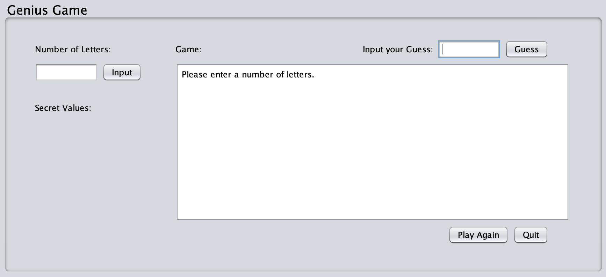

# Introduction to Computer Science, Grade 11

## Genius Game

For the final course project, I was tasked with building a game program that generated a random combination of the letters 'r', 'g', and 'b' given a number of letters. Players were tasked with guessing possible combinations, and the program would declare the number of letters guessed as the correct letter in the correct position.    
Date developed: May-June 2020

### Technical Details

1. Used the Netbeans GUI builder to create a user interface 
2. Utilizes multiple functions to generate the letter combination, compare guesses, and display information on the screen.
3. Implements loops and conditions.

## Hangman
Created a basic hangman program for an early course project, with output displayed on the console. Player 1 is tasked with inputting a word for player 2 to guess. Player 2 has 8 total tries to guess the word. After each guess, the word (with dashes replacing not-yet guessed letters) displays, along with the alphabet with previously guessed letters replaced with slash. Incorrectly guessed letters cumulatively create a hangman visual.    
Date developed: February 2020

### Technical Details

1. Implements loops and conditions.

